Examining Correlations: Health, Exhaustion, and Depression among Mmed
Medical Students
================

**Data Summary and Hypothesis:**

This dataset investigates the relationship between the health status,
exhaustion scores, and depression scores of medical students in
Switzerland. It comprises demographic information, self-reported health
data, and psychological test results, providing a comprehensive
understanding of the mental states of 886 medical students. The research
question for this report is **“Whether there is a correlation among the
health status, exhaustion scores, and depression scores of medical
students studying in Mmed years.”**

To address this question, we focus on four important variables: “health”
(self-reported health status on a scale of 1 to 5), “mbi_ex” (exhaustion
scores measured on a scale of 0 to 30 using the Maslach Burnout
Inventory), “cesd” (depression scores measured on a scale of 0 to 60
using the Center for Epidemiologic Studies), and “year” (the year of
study for medical students, ranging from 1 to 6).

Initially, we select these variables and filter out the first three
years (Bmed1, Bmed2, Bmed3) of student entries based on the “year”
variable. This results in a dataframe containing 363 observations from
Mmed years (Mmed1, Mmed2, Mmed3). Subsequently, we examine the dataset
for any missing values and ensure that there are none. Afterward, we
analyze the summary statistics of our variables. Furthermore, we
identify outliers using boxplots. In this analysis, we decide to retain
the outliers for “mbi_ex” and “cesd” variables, even if they exceed the
maximum score level.

``` r
knitr::opts_chunk$set(echo = TRUE)
library(dplyr)
library(ggplot2)
library(knitr)
library(pastecs)
library(ppcor)
library(corrplot)
```

``` r
med.data<-read.csv("Data Carrard et al. 2022 MedTeach.csv")

#filtering Mmed students
selected.med.data <- med.data %>% dplyr::select(year,health, mbi_ex,cesd) %>% filter(year>=4)

# Missing Data Check
missing.data.whole <- selected.med.data %>% summarize_all(~sum(is.na(.))) #no missing data found

#outliers checking
selected.med.data %>% ggplot(aes(x= health,y = mbi_ex)) + geom_boxplot()
```

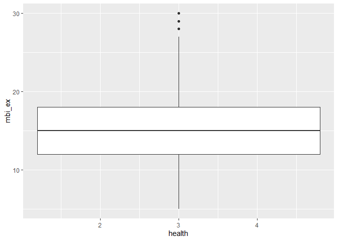<!-- -->

``` r
#outliers checking
selected.med.data %>% ggplot(aes(health,cesd)) + geom_boxplot()
```

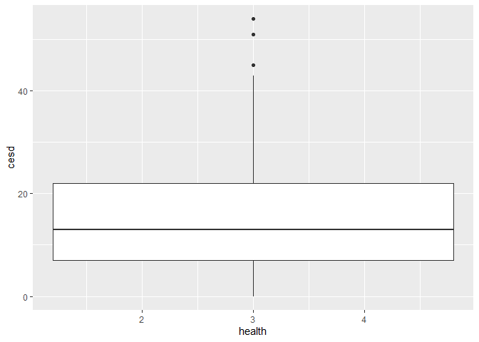<!-- -->

``` r
#summary statistics
kable(summary(selected.med.data))
```

|     | year          | health        | mbi_ex        | cesd          |
|:----|:--------------|:--------------|:--------------|:--------------|
|     | Min. :4.000   | Min. :1.000   | Min. : 5.00   | Min. : 0.00   |
|     | 1st Qu.:4.000 | 1st Qu.:3.000 | 1st Qu.:12.00 | 1st Qu.: 7.00 |
|     | Median :5.000 | Median :4.000 | Median :15.00 | Median :13.00 |
|     | Mean :4.972   | Mean :3.871   | Mean :15.35   | Mean :15.26   |
|     | 3rd Qu.:6.000 | 3rd Qu.:5.000 | 3rd Qu.:18.00 | 3rd Qu.:22.00 |
|     | Max. :6.000   | Max. :5.000   | Max. :30.00   | Max. :54.00   |

We will analyze three correlations between our variables: health with
mbi_ex, health with cesd, and mbi_ex with cesd. However, due to health
being a categorical variable, we cannot use Pearson’s correlation, which
requires interval data. Instead, we will use Spearman’s correlation, a
non-parametric test, to examine the relationship between health and
mbi_ex as well as health and cesd.

**Normality Check: Histograms**

Additionally, we will assess normality for statistical significance and
calculate confidence intervals for the Pearson’s correlation test
between mbi_ex and cesd, which are interval data variables.

``` r
# histograms
selected.med.data %>% ggplot(aes(mbi_ex)) + geom_histogram()
```

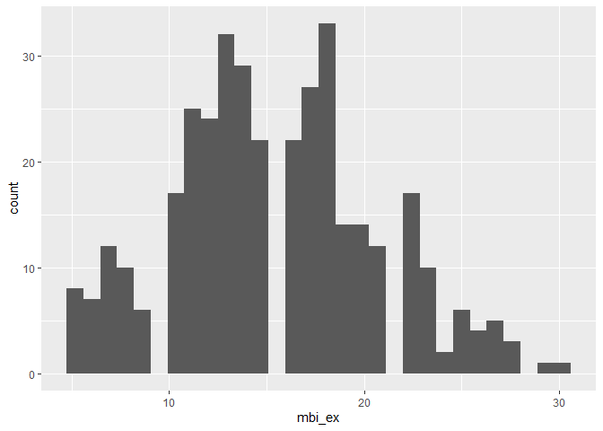<!-- -->

``` r
selected.med.data %>% ggplot(aes(cesd)) + geom_histogram()
```

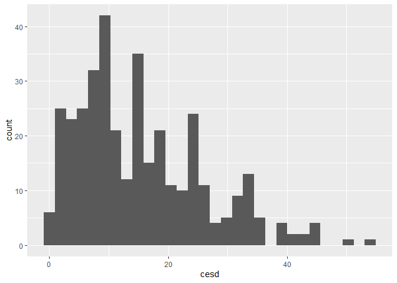<!-- -->

**Normality Check: QQ Plots**

To assess the normality of the variables, we conducted several tests.
Firstly, we created a QQ plot, which revealed that the columns were not
normally distributed.

``` r
#qq plot
selected.med.data %>% ggplot(aes(sample=mbi_ex)) + stat_qq() + geom_qq_line(aes(color='red'))+labs(x= 'Exhaustion scale')
```

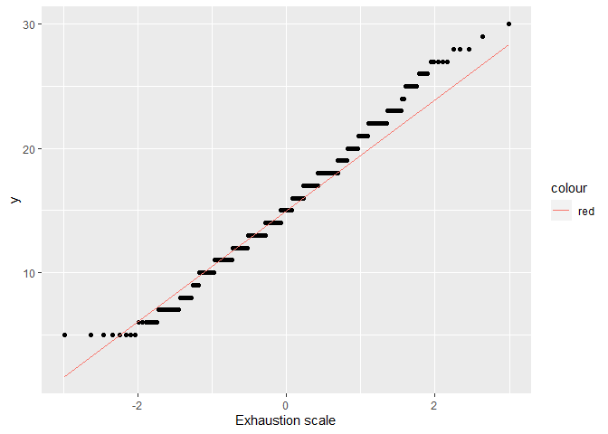<!-- -->

``` r
selected.med.data %>% ggplot(aes(sample=cesd)) + stat_qq() + geom_qq_line(aes(color='red'))
```

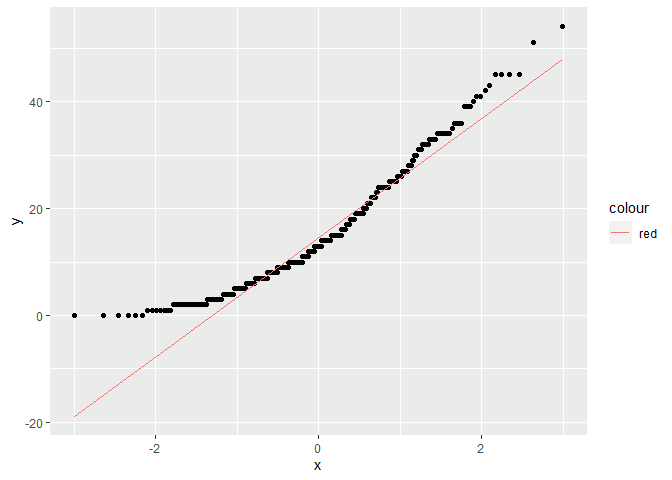<!-- -->

**Normality Check: Shapiro-Wilk & skewness & kurtosis**

Additionally, we performed the Shapiro-Wilk test and examined the
skewness and kurtosis values. Both variables, mbi_ex and cesd, exhibited
skewness and kurtosis values that were not close to 0, and the p-values
for both tests were less than 0.05 at a 95% confidence interval.
Consequently, we rejected the null hypothesis of the Shapiro-Wilk test,
concluding that mbi_ex and cesd were not normally distributed.

``` r
#skewness & kurtosis
stat.desc(selected.med.data$mbi_ex,basic = FALSE, norm= TRUE)['skew.2SE']
```

    ##  skew.2SE 
    ## 0.9572502

``` r
stat.desc(selected.med.data$mbi_ex,basic = FALSE, norm= TRUE)['kurt.2SE']
```

    ##   kurt.2SE 
    ## -0.5355703

``` r
stat.desc(selected.med.data$cesd,basic = FALSE, norm= TRUE)['skew.2SE']
```

    ## skew.2SE 
    ## 3.430912

``` r
stat.desc(selected.med.data$cesd,basic = FALSE, norm= TRUE)['kurt.2SE']
```

    ##  kurt.2SE 
    ## 0.6287876

``` r
#shapiro-wilk test mbi_ex
shapiro.test(selected.med.data$mbi_ex)
```

    ## 
    ##  Shapiro-Wilk normality test
    ## 
    ## data:  selected.med.data$mbi_ex
    ## W = 0.9865, p-value = 0.001843

``` r
#shapiro-wilk test cesd
shapiro.test(selected.med.data$cesd)
```

    ## 
    ##  Shapiro-Wilk normality test
    ## 
    ## data:  selected.med.data$cesd
    ## W = 0.9347, p-value = 1.593e-11

mbi_ex and cesd are both not normal so we have 2 options 1. Change the
data 2. Change the model

**Normality Check: Data Transformation**

To address this, we applied various transformations (such as log, sqrt,
and 1/x) to the variables and repeated the tests.

1.  LOG TRANSFORMATION:

``` r
#LOG TRANSFORMATION
med.data.log <- selected.med.data %>% mutate(mbi_ex_log = log(mbi_ex+1), cesd_log = log(cesd+1))
med.data.log %>% ggplot(aes(sample=mbi_ex_log)) + stat_qq() + geom_qq_line(aes(color='red'))
```

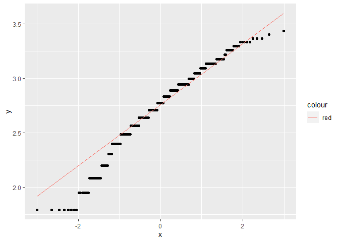<!-- -->

``` r
med.data.log %>% ggplot(aes(sample=cesd_log)) + stat_qq() + geom_qq_line(aes(color='red'))
```

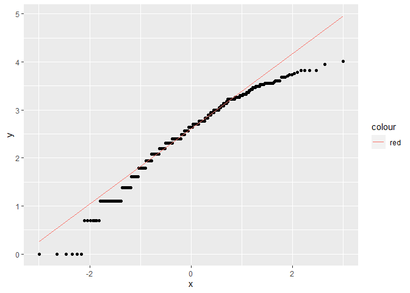<!-- -->

``` r
stat.desc(med.data.log$mbi_ex_log,basic = FALSE, norm= TRUE)['skew.2SE']
```

    ##  skew.2SE 
    ## -2.447957

``` r
stat.desc(med.data.log$mbi_ex_log,basic = FALSE, norm= TRUE)['kurt.2SE']
```

    ##  kurt.2SE 
    ## 0.3842835

``` r
stat.desc(med.data.log$cesd_log,basic = FALSE, norm= TRUE)['skew.2SE']
```

    ##  skew.2SE 
    ## -3.059203

``` r
stat.desc(med.data.log$cesd_log,basic = FALSE, norm= TRUE)['kurt.2SE']
```

    ## kurt.2SE 
    ## 0.955344

``` r
shapiro.test(med.data.log$mbi_ex_log)
```

    ## 
    ##  Shapiro-Wilk normality test
    ## 
    ## data:  med.data.log$mbi_ex_log
    ## W = 0.96513, p-value = 1.289e-07

``` r
shapiro.test(med.data.log$cesd_log)
```

    ## 
    ##  Shapiro-Wilk normality test
    ## 
    ## data:  med.data.log$cesd_log
    ## W = 0.95513, p-value = 4.493e-09

1.  SQRT TRANSFORMATION:

``` r
#SQRT TRANSFORMATION
med.data.sqrt <- selected.med.data %>% mutate(mbi_ex_sqrt = sqrt(mbi_ex), cesd_sqrt = sqrt(cesd))
med.data.sqrt %>% ggplot(aes(sample=mbi_ex_sqrt)) + stat_qq() + geom_qq_line(aes(color='red'))
```

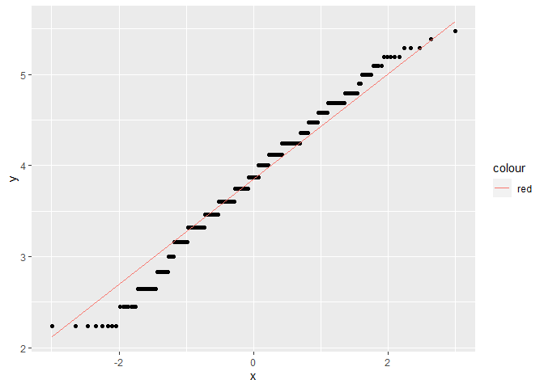<!-- -->

``` r
med.data.sqrt %>% ggplot(aes(sample=cesd_sqrt)) + stat_qq() + geom_qq_line(aes(color='red'))
```

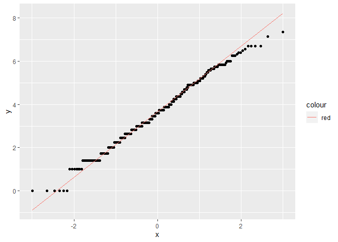<!-- -->

``` r
stat.desc(med.data.sqrt$mbi_ex_sqrt,basic = FALSE, norm= TRUE)['skew.2SE']
```

    ##   skew.2SE 
    ## -0.8163346

``` r
stat.desc(med.data.sqrt$mbi_ex_sqrt,basic = FALSE, norm= TRUE)['kurt.2SE']
```

    ##  kurt.2SE 
    ## -0.486683

``` r
stat.desc(med.data.sqrt$cesd_sqrt,basic = FALSE, norm= TRUE)['skew.2SE']
```

    ##    skew.2SE 
    ## -0.07173687

``` r
stat.desc(med.data.sqrt$cesd_sqrt,basic = FALSE, norm= TRUE)['kurt.2SE']
```

    ##   kurt.2SE 
    ## -0.6618693

``` r
shapiro.test(med.data.sqrt$mbi_ex_sqrt)
```

    ## 
    ##  Shapiro-Wilk normality test
    ## 
    ## data:  med.data.sqrt$mbi_ex_sqrt
    ## W = 0.98703, p-value = 0.002486

``` r
shapiro.test(med.data.sqrt$cesd_sqrt)
```

    ## 
    ##  Shapiro-Wilk normality test
    ## 
    ## data:  med.data.sqrt$cesd_sqrt
    ## W = 0.99292, p-value = 0.08457

``` r
med.data.sqrt %>% ggplot(aes(mbi_ex_sqrt)) + geom_histogram()
```

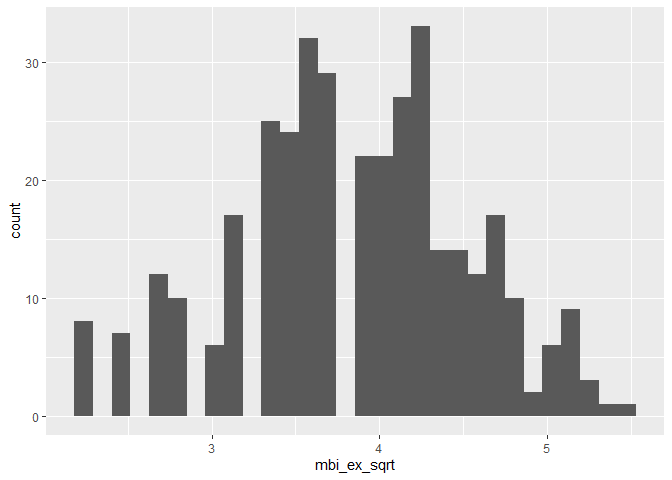<!-- -->

``` r
med.data.sqrt %>% ggplot(aes(cesd_sqrt)) + geom_histogram()
```

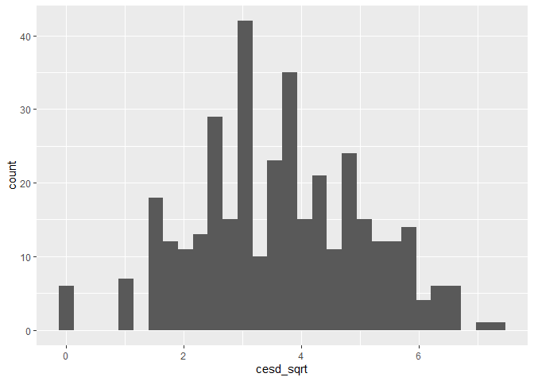<!-- -->

3.  1/x TRANSFORMATION

``` r
# 1/x TRANSFORMATION
med.data.byx <- selected.med.data %>% mutate(mbi_ex_byx = 1/(mbi_ex+1), cesd_byx = 1/(cesd+1))
med.data.byx %>% ggplot(aes(sample=mbi_ex_byx)) + stat_qq() + geom_qq_line(aes(color='red'))
```

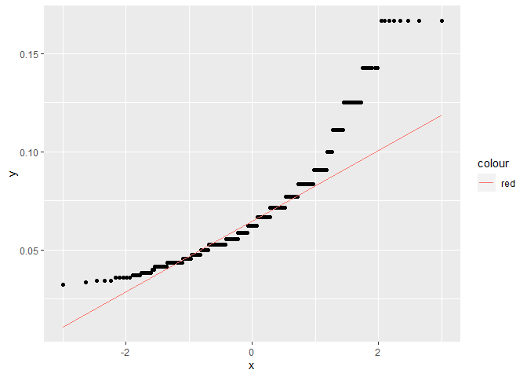<!-- -->

``` r
med.data.byx %>% ggplot(aes(sample=cesd_byx)) + stat_qq() + geom_qq_line(aes(color='red'))
```

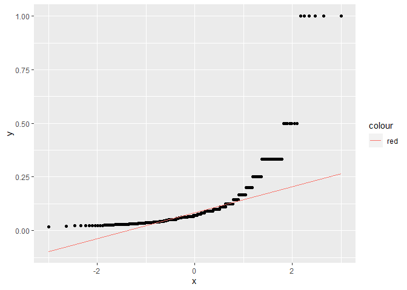<!-- -->

``` r
stat.desc(med.data.byx$mbi_ex_byx,basic = FALSE, norm= TRUE)['skew.2SE']
```

    ## skew.2SE 
    ## 6.301773

``` r
stat.desc(med.data.byx$mbi_ex_byx,basic = FALSE, norm= TRUE)['kurt.2SE']
```

    ## kurt.2SE 
    ##  5.48247

``` r
stat.desc(med.data.byx$cesd_byx,basic = FALSE, norm= TRUE)['skew.2SE']
```

    ## skew.2SE 
    ## 15.45691

``` r
stat.desc(med.data.byx$cesd_byx,basic = FALSE, norm= TRUE)['kurt.2SE']
```

    ## kurt.2SE 
    ##  37.3596

``` r
shapiro.test(med.data.byx$mbi_ex_byx)
```

    ## 
    ##  Shapiro-Wilk normality test
    ## 
    ## data:  med.data.byx$mbi_ex_byx
    ## W = 0.8496, p-value < 2.2e-16

``` r
shapiro.test(med.data.byx$cesd_byx)
```

    ## 
    ##  Shapiro-Wilk normality test
    ## 
    ## data:  med.data.byx$cesd_byx
    ## W = 0.55481, p-value < 2.2e-16

The sqrt transformation appeared to normalize the cesd variable, as
indicated by a p-value greater than 0.05 at a 95% confidence interval,
an acceptable QQ plot, and skewness and kurtosis values. However, the
mbi_ex variable failed to normalize even after applying the sqrt
transformation. Since the sqrt transformation did not work for both
variables simultaneously, it is not a suitable transformation. Based on
these results, it is advisable to use a non-parametric Spearman’s
correlation for the mbi_ex and cesd variables.

**Analysis: Correlation**

To figure out whether there is some relation between health status,
exhaustion scores, and depression scores of Mmed students, we will
calculate non-parametric Spearman’s correlation on the selected pair
variables. This correlation matrix plot was designed using corrplot
library.

Furthermore, visual plots depicting the correlations between health and
mbi_ex, health and cesd, as well as mbi_ex and cesd, can be generated to
illustrate these relationships.

``` r
# plots for correlation
selected.med.data %>% ggplot(aes(mbi_ex,cesd)) + geom_point(color='blue') + geom_smooth(method = "lm",se=FALSE, color='red') + labs(x="MBI-Exhaustion Scale", y="CES-Depression Scale", title = "Correlation: Exhaustion with Depression") + theme_bw()
```

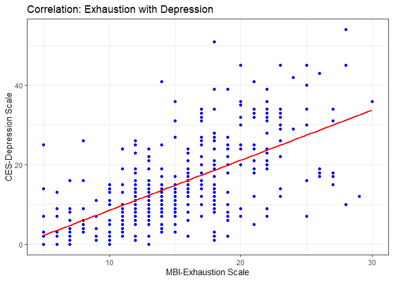<!-- -->

``` r
selected.med.data %>% ggplot(aes(health,cesd)) + geom_point(color='blue') + geom_smooth(method = "lm",se=FALSE, color='red') + labs(x="self-reported health status", y="CES-Depression Scale", title = "Correlation: Health status with Depression") + theme_bw()
```

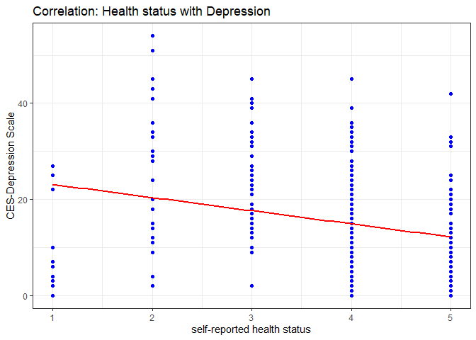<!-- -->

``` r
selected.med.data %>% ggplot(aes(health,mbi_ex)) + geom_point(color='blue') + geom_smooth(method = "lm",se=FALSE, color='red') + labs(x="self-reported health status", y="MBI-Exhaustion Scale", title = "Correlation: Health status with Exhaustion") + theme_bw()
```

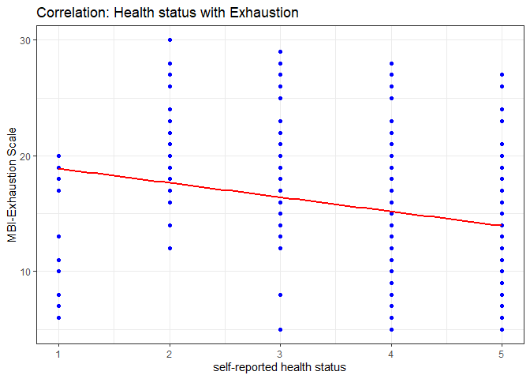<!-- -->

The correlation matrix plot reveals that self-reported health status
(health) exhibits a substantial and comparable correlation with both the
MBI-Exhaustion scale (mbi_ex) and the CES-Depression scale (cesd).
Additionally, there is a notable and positive correlation between the
MBI-Exhaustion scale (mbi_ex) and the CES-Depression scale (cesd),
indicating a strong association between exhaustion and depression.

``` r
cor.mat.sp <- selected.med.data %>% dplyr::select(health, mbi_ex,cesd) %>%
  cor(use="complete.obs", method = "spearman")

corrplot(cor.mat.sp,method = 'color', outline= T, addCoef.col='black', diag=T, number.digits = 5, col=colorRampPalette(c("blue", "white", "indianred"))(20))
```

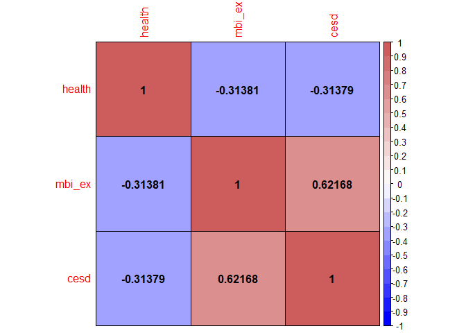<!-- -->

**Correlation: HEALTH and MBI_EX**

There is a significant negative correlation of medium effect between the
self-reported health status and MBI – Exhaustion scale of Mmed students,
(rs(363) = -.31, p \< .001).

``` r
# HEALTH and MBI_EX
cor(selected.med.data$health,selected.med.data$mbi_ex,method = "spearman")
```

    ## [1] -0.3138082

``` r
cor.test(selected.med.data$health,selected.med.data$mbi_ex,method = "spearman")
```

    ## Warning in cor.test.default(selected.med.data$health,
    ## selected.med.data$mbi_ex, : Cannot compute exact p-value with ties

    ## 
    ##  Spearman's rank correlation rho
    ## 
    ## data:  selected.med.data$health and selected.med.data$mbi_ex
    ## S = 10473631, p-value = 9.757e-10
    ## alternative hypothesis: true rho is not equal to 0
    ## sample estimates:
    ##        rho 
    ## -0.3138082

**Correlation: HEALTH and cesd**

There is a significant negative correlation of medium effect between the
self-reported health status and CES – Depression scale of Mmed students,
(rs(363) = -.31, p \< .001).

``` r
# HEALTH and cesd
cor(selected.med.data$health,selected.med.data$cesd,method = "spearman")
```

    ## [1] -0.3137864

``` r
cor.test(selected.med.data$health,selected.med.data$cesd,method = "spearman")
```

    ## Warning in cor.test.default(selected.med.data$health, selected.med.data$cesd, :
    ## Cannot compute exact p-value with ties

    ## 
    ##  Spearman's rank correlation rho
    ## 
    ## data:  selected.med.data$health and selected.med.data$cesd
    ## S = 10473458, p-value = 9.784e-10
    ## alternative hypothesis: true rho is not equal to 0
    ## sample estimates:
    ##        rho 
    ## -0.3137864

**Correlation: mbi_ex and cesd**

There is a significant positive correlation with a large effect between
the MBI – Exhaustion scale and CES – Depression scale of Mmed students,
(rs(363) = .62, p \< .001).

``` r
# mbi_ex and cesd
cor(selected.med.data$mbi_ex,selected.med.data$cesd,method = "spearman")
```

    ## [1] 0.6216771

``` r
cor.test(selected.med.data$mbi_ex,selected.med.data$cesd,method = "spearman")
```

    ## Warning in cor.test.default(selected.med.data$mbi_ex, selected.med.data$cesd, :
    ## Cannot compute exact p-value with ties

    ## 
    ##  Spearman's rank correlation rho
    ## 
    ## data:  selected.med.data$mbi_ex and selected.med.data$cesd
    ## S = 3015976, p-value < 2.2e-16
    ## alternative hypothesis: true rho is not equal to 0
    ## sample estimates:
    ##       rho 
    ## 0.6216771

The obtained p-value, which is considerably smaller than 0.05 at a 95%
confidence interval, provides substantial evidence to reject the null
hypothesis and support the alternative hypothesis. Consequently, we can
confidently conclude that there exists a correlation between the pairs
of variables in question.

**Partial-Correlation**

To explore the impact of a third variable on each pair of correlated
variables, we conducted partial correlation tests using Spearman as the
parameter. The results, presented in Table 1, indicate that all the
p-values are less than 0.05, suggesting the presence of significant
partial correlations. Specifically, when considering the relationship
between health and mbi_ex with cesd as the influencing factor, there is
a notable and negative correlation of low to medium effect (rs(363) =
-.16, p \< .001). Similarly, when examining the correlation between
health and cesd while controlling for mbi_ex, a significant negative
correlation of low to medium effect is observed (rs(363) = -.16, p \<
.001). In contrast, when analyzing the association between mbi_ex and
cesd with health as the controlling variable, a substantial positive
correlation of large effect is found (rs(363) = .58, p \< .001).

HEALTH AND MBI_EX, controlling variable: CESD

``` r
kable(pcor.test(selected.med.data$health,selected.med.data$mbi_ex,selected.med.data$cesd,method="spearman"))
```

|   estimate |   p.value | statistic |   n |  gp | Method   |
|-----------:|----------:|----------:|----:|----:|:---------|
| -0.1596507 | 0.0023143 | -3.068517 | 363 |   1 | spearman |

HEALTH AND CESD, controlling variable: MBI_EX

``` r
kable(pcor.test(selected.med.data$health,selected.med.data$cesd,selected.med.data$mbi_ex,method="spearman"))
```

|   estimate |   p.value | statistic |   n |  gp | Method   |
|-----------:|----------:|----------:|----:|----:|:---------|
| -0.1596045 | 0.0023212 | -3.067605 | 363 |   1 | spearman |

CESD AND MBI_EX, controlling variable: HEALTH

``` r
kable(pcor.test(selected.med.data$cesd,selected.med.data$mbi_ex,selected.med.data$health,method="spearman"))
```

|  estimate | p.value | statistic |   n |  gp | Method   |
|----------:|--------:|----------:|----:|----:|:---------|
| 0.5803552 |       0 |  13.52156 | 363 |   1 | spearman |

**Conclusion**

The significant relationships between self-reported health,
MBI-Exhaustion scale, and CES-Depression scale indicate their
importance. For Mmed students, self-reported health shows comparable
correlations with the exhaustion scale and depression scale (rs(363) =
-.31). The correlation between exhaustion and depression scales is
strong. Controlling variables (Depression scale and Exhaustion scale)
significantly affect the correlations of health-mbi_ex and health-cesd,
changing the medium effect correlation (-0.31) to a low-to-medium effect
correlation (-0.15). Self-reported health has a minor impact on the
correlation between exhaustion and depression scales, resulting in a
6.5% decrease in the rho value.
